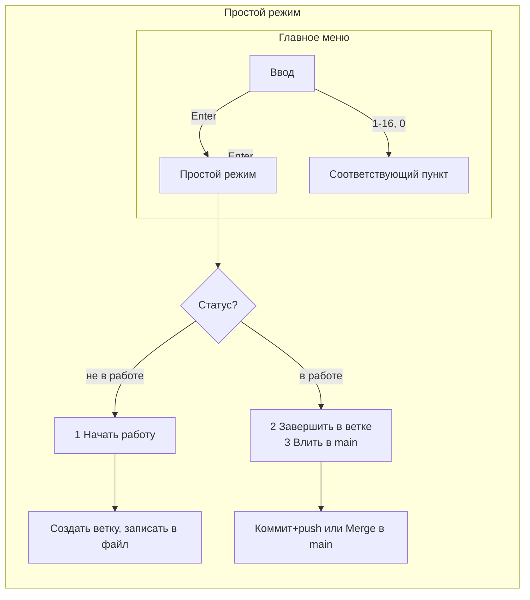

# Простой режим в Git Helper

## Поведение

- **Вход в простой режим**: в главном меню ([_to-GITHUB.bat](D:\Application\TESTS_to-GITHUB_to-GITHUB.bat)) приглашение  `>` — пользователь нажимает **Enter** без ввода цифры → переход в простой режим.
- **Выход из простого режима**: в простом режиме приглашение ввода — пользователь нажимает **Enter** без выбора → возврат в главное меню (как сейчас).
- **Главная ветка**: всегда **main**; если ветки main нет — сообщение об ошибке и возврат в меню.

## Состояния и хранение

- **Статус «не в работе»**: нет активной рабочей ветки (файл состояния пуст или отсутствует, либо текущая ветка не совпадает с сохранённой).
- **Статус «в работе»**: есть сохранённая рабочая ветка и мы на ней.

Файл состояния: `**.git-helper-simple**` в корне репозитория. В нём одна строка — имя текущей рабочей ветки (например `simple/20250212-1430`). Если файла нет или он пустой — считаем «не в работе».

При открытии простого режима:

1. Читаем текущую ветку: `git branch --show-current`.
2. Если есть файл `.git-helper-simple`, читаем из него имя ветки `WORK_BRANCH`.
3. Если `WORK_BRANCH` совпадает с текущей веткой → статус **«в работе»**, иначе **«не в работе»** (и при желании можно очистить файл, если мы уже не на той ветке).
4. Если файла нет или он пустой → **«не в работе»**.

## Экран простого режима

```
=== ПРОСТОЙ РЕЖИМ ===

  Статус: не в работе   (или: в работе | ветка: simple/20250212-1430)

  1  Начать работу      (создать ветку от main, переключиться)
  2  Завершить в ветке  (закоммитить, отправить, перейти на main)   [только если в работе]
  3  Влить в main       (смержить в main, отправить, перейти на main) [только если в работе]

  [Enter] — в главное меню
  >
```

- В состоянии «не в работе» показывать только пункт **1** (и Enter).
- В состоянии «в работе» показывать **2**, **3** и Enter.

## Логика пунктов

### 1. Начать работу (только при «не в работе»)

1. Проверить наличие ветки **main** (`git rev-parse --verify main`); если нет — сообщение и возврат в простое меню.
2. Переключиться на **main**, выполнить `git pull` (предупредить при ошибке, но не блокировать).
3. Создать ветку с именем вида `**simple/YYYYMMDD-HHMM**` (текущие дата и время), переключиться на неё.
4. Записать имя этой ветки в `.git-helper-simple`.
5. Вывести сообщение вида: «Рабочая ветка создана: simple/20250212-1430. Делайте изменения, затем снова откройте программу и выберите завершение или влить в main.»

### 2. Завершить в ветке (только при «в работе»)

1. Убедиться, что текущая ветка = ветка из `.git-helper-simple`.
2. Спросить сообщение коммита (или использовать фиксированное, например «Завершение работы в простом режиме»).
3. `git add .` → `git commit -m "..."` → `git push origin <work_branch>`.
4. Удалить содержимое/файл `.git-helper-simple`.
5. Переключиться на **main** (`git switch main`).
6. Сообщение: «Работа завершена в ветке &lt;имя&gt;. Вы на main. Позже можно влить ветку через обычное меню (Merge).»

### 3. Влить в main (только при «в работе»)

1. Убедиться, что текущая ветка = ветка из `.git-helper-simple`.
2. Опционально: закоммитить незакоммиченное (как в п.2: add, commit, push в рабочую ветку).
3. Переключиться на **main**, выполнить `git pull`, затем `git merge <work_branch>` (или `git merge --no-ff <work_branch>` для явного merge-коммита).
4. При успехе: `git push origin main`.
5. Удалить рабочую ветку локально (`git branch -d <work_branch>`) и при желании на remote (`git push origin --delete <work_branch>`). Очистить `.git-helper-simple`.
6. Остаёмся на **main**. Сообщение: «Ветка влита в main и отправлена.»

## Изменения в основном меню

В блоке ввода выбора (около строк 33–34):

- Сейчас: `set /p choice="  ^> "` и затем проверки `if "%choice%"=="1"` и т.д.
- Добавить **перед** проверками: если `"%choice%"==""` (пустая строка), перейти на метку `:simple_mode` (новый блок простого режима).
- Остальная логика меню без изменений.

## Структура файла (новые метки и блоки)

- После проверки `if "%choice%"==""` → `goto simple_mode`.
- **:simple_mode** — очистка экрана, определение статуса (чтение ветки + `.git-helper-simple`), вывод шапки «ПРОСТОЙ РЕЖИМ» и статуса, вывод пунктов 1 (и при «в работе» 2 и 3), приглашение ввода.
  - Пустой ввод → `goto menu`.
  - 1 → `:simple_start` (начать работу).
  - 2 → `:simple_finish_branch` (завершить в ветке).
  - 3 → `:simple_merge_main` (влить в main).
- Реализация **:simple_start**, **:simple_finish_branch**, **:simple_merge_main** по шагам выше. Везде при ошибках — сообщение, пауза, возврат в `:simple_mode` (или в меню при критичной ошибке).

## Важные детали

- Имя рабочей ветки: `**simple/YYYYMMDD-HHMM**` (например `simple/20250212-1430`), чтобы не пересекаться с другими ветками и было понятно происхождение.
- Дату/время в batch: через `%date%` и `%time%` с заменой недопустимых символов (пробелы, двоеточия, точки) на `-` или убрать.
- Файл `.git-helper-simple` лучше добавить в **.gitignore**, чтобы не коммитить состояние (опционально, можно упомянуть в комментарии или в справочнике).
- Все команды git через `git ...` с проверкой `!errorlevel!` и понятными сообщениями на русском.

## Краткая схема потока




Итог: один файл [_to-GITHUB.bat](D:\Application\TESTS_to-GITHUB_to-GITHUB.bat) расширяется: обработка пустого ввода в главном меню, новый блок простого режима с чтением/записью `.git-helper-simple`, три сценария (начать работу, завершить в ветке, влить в main) при главной ветке **main**.